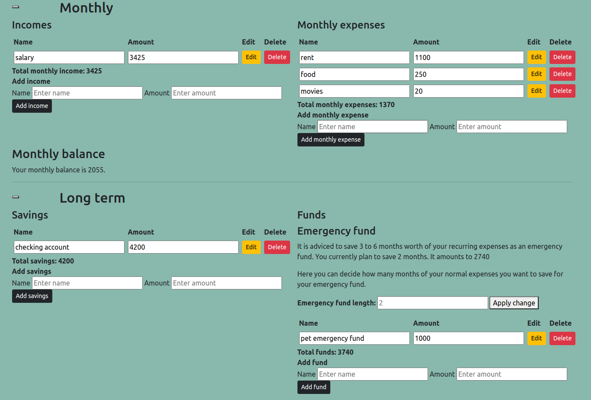
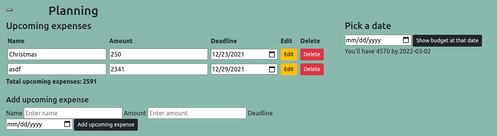

# Budget app

A web app for planing household budgets.

## Usage

After creating an account and logging in, the user can create a household. In the household, the user can input their monthly incomes and expenses, as well as savings.



The user can plan their household budget by adding upcoming expenses and seeing how much money they'll have by a selected date.



## Running

 You can run the application with the `run.sh` script. The database GUI is available at `localhost:8888` with the following credentials:

```
System: PostgreSQL
Server: db
Username: user
Password: password
Database:
```

The application is available at `localhost:8080`.
